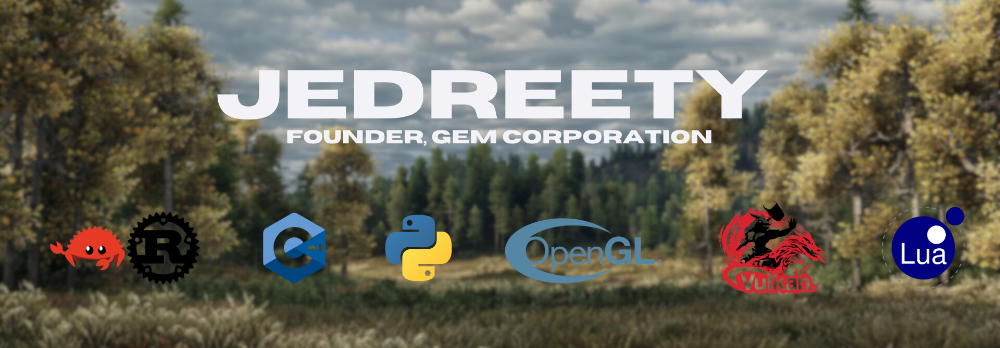

<div align="center">

### Software engineer in the making

I build game engines, compilers and tools for C and C++.<br>
And the side projects no one asked for.

<sub>Computer science at Université Paris Cité · Apprentice developer at Banque de France · Paris</sub>

<br>

**[Portfolio](https://jedreety.github.io/Jedreety/)** · **[CStarter](https://github.com/jedreety/CStarter)** · **[Gem Logger](https://github.com/jedreety/Gem-Logger)**

</div>

<br>

## Now building

<a href="https://github.com/jedreety/CStarter"></a>

**[CStarter](https://github.com/jedreety/CStarter)** turns a few JSON files into a clean Visual Studio solution.<br>
It builds it, runs it, and brings your libraries along.<br>
Free and open source, for Windows.

## The Gem family

**Gem Engine** · a game engine in C++, on OpenGL and Vulkan, with GLFW and GLM.<br>
**Gem Compiler** · `.gem`, my own language, compiled down to assembly by a compiler written in C++.<br>
**[Gem Logger](https://github.com/jedreety/Gem-Logger)** · a header-only C++23 logger: lock-free queue, seven levels, JSON output, file rotation.

```cpp
#define GEMLOG_SIMPLE_HANDLER_CONSOLE
#include "logger.h"

int main() {
    LOG_INFO("Server started on port @{port}", {{"port", 8080}});
}
```

## In the lab

**AshBorn** · a voxel engine in C++23 and OpenGL: procedural biomes, combat, NPCs.<br>
**WiFi Pulse** · WiFi sensing that detects people through walls, then recognizes them by heartbeat and breathing.<br>
**Queens Solver** · a LinkedIn Queens solver in Python, built on an ECS with PyTorch and TensorFlow.

<br>

<picture>
  <source media="(prefers-color-scheme: dark)" srcset="Assets/Images/signature-dark.webp">
  
</picture>
