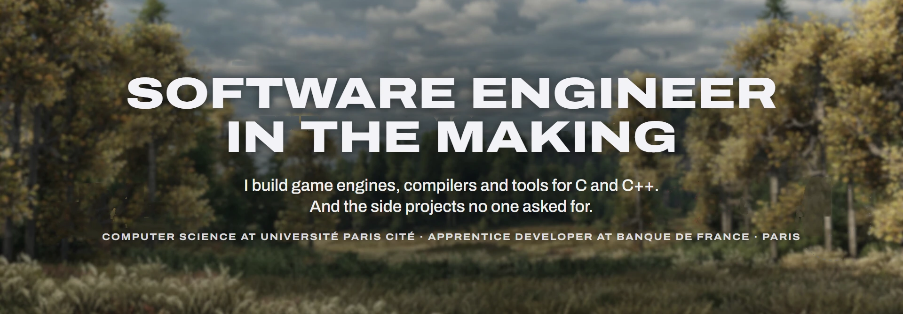
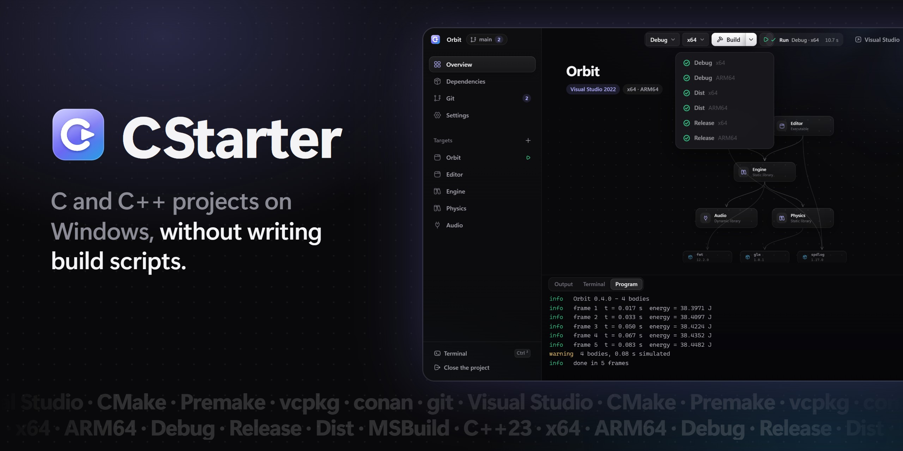
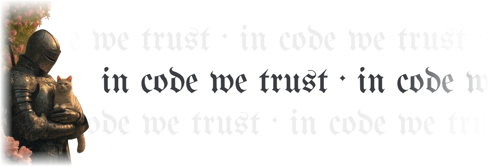

**[Portfolio](https://jedreety.github.io/Jedreety/)** · **[CStarter](https://github.com/jedreety/CStarter)** · **[Gem Logger](https://github.com/jedreety/Gem-Logger)**

 

## Now building

 

<picture>
  <source media="(prefers-color-scheme: dark)" srcset="Assets/Images/signature-dark.webp">
  
</picture>
